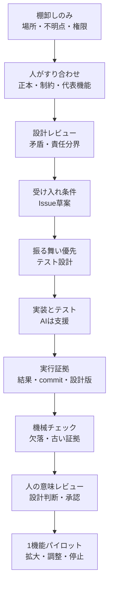
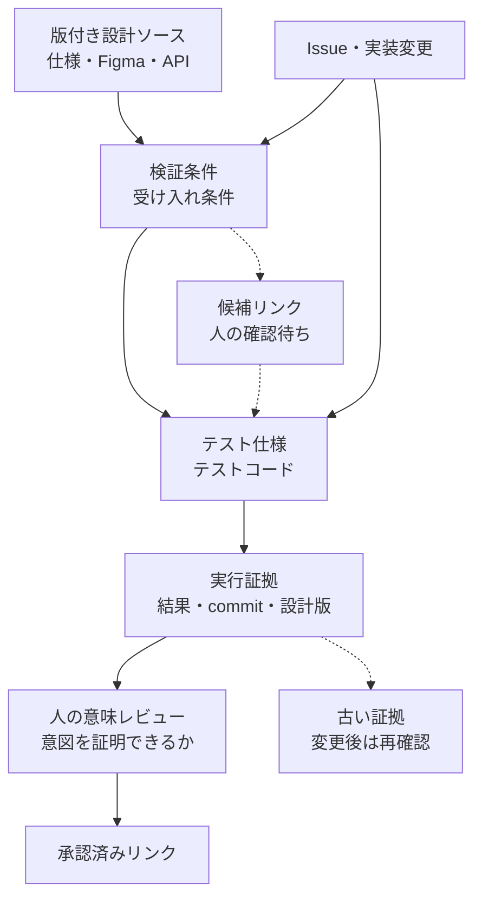

# フロントエンド品質プロセス導入パッケージ

このディレクトリは、一般的なWeb開発プロジェクトで既存テンプレートや合意済み仕様を尊重しながら、設計書・テスト仕様・テストコード・実行証拠のトレーサビリティを段階導入するためのレビュー用成果物です。

## 構成

- `process-definition.md`: 開発プロセス定義、段階導入、責任分界、未解決事項。
- `project-adaptation-guide.md`: 案件ごとに既存資料・API資産・承認慣行を分析する手順。
- `copilot/skills/frontend-trace-quality/SKILL.md`: GitHub Copilot Agent Skills向けに配置できるSkill本体。
- `copilot/prompts/*.prompt.md`: IDE内Copilotで明示的に呼び出すタスク別プロンプト候補。
- `copilot/copilot-instructions.md`: repository custom instructionsに転記する短い共通方針案。
- `examples/tiny-feature/`: 架空の検索画面を使った最小評価例。
- `scripts/trace_check.py`: 最小の決定的トレース整合チェッカー。

`SKILL.md`はCopilot Agent Skills等の配置を想定し、英語で書いています。プロセス定義や案件適応ガイドは日本語で維持します。

## 位置づけ

これはAutomotive SPICE認証や完全準拠を主張するものではありません。Automotive SPICE PAM 4.0 SWE.6.BP4の「双方向対応と整合性」およびNote 4の「リンク存在だけでは内容整合を意味しない」という考え方を、Web開発プロジェクトに適切な粒度で参考にしたものです。

GitHub Copilotの利用は、IDE内Copilotによる人主導の対話・編集を中心に想定します。GitHub上のIssueからPRを自動作成するcoding agentは、使える場合があっても標準工程には含めません。

導入は全工程のつながりを定義したうえで、代表的な機能1つの縦通しパイロットから始めます。全プロジェクト一斉導入や全工程無人化は前提にしません。

最初の適用は discovery-only にします。docs repo と code repo の両方のroot、読める資産の場所、読めない/不明な項目、既存instructions/テンプレート、出力先権限だけを報告し、ファイル編集、Issue作成、commitは行いません。人が確認してから、設計レビュー、Issue分解、代表機能パイロットへ進みます。

## 想定開発プロセス

このキットは、AIに実装や整理を手伝わせる前に、既存資料、合意済み仕様、承認経路、責任分界を人が確認できる状態へ寄せるためのものです。AIは棚卸し、差分整理、候補作成、テスト案作成を支援できますが、正本判断、仕様承認、設計判断、公開・提出判断は人が行います。詳しい工程は [`process-definition.md`](process-definition.md) と [`project-adaptation-guide.md`](project-adaptation-guide.md) に分けています。



最初の一周では、代表機能を一つだけ選びます。全体に一斉導入する前に、既存テンプレートを壊さずに、Issue、受け入れ条件、テスト仕様、テストコード、実行証拠、レビュー観点がつながるかを確認します。

## トレーサビリティの考え方

トレーサビリティは「IDが一致していること」ではなく、「合意済みの設計意図が、検証条件、テスト、実行証拠、人のレビューまで追えること」です。リンクは多対多になり得るため、図では主な流れだけを示しています。候補リンクと承認済みリンクを分け、変更時には設計から証拠へ、証拠から設計へ双方向に影響をたどります。



例として、架空の検索画面で「無効なメールアドレスなら保存できず、エラーメッセージを表示する」という設計項目があるとします。そこから「保存ボタンが送信を抑止する」「エラー文言が表示される」「修正後に保存できる」という検証条件を作り、Storybook InteractionやE2Eに割り当て、実行結果を設計版とcommitに紐づけます。後から「メール形式の許容ルール」が変わった場合、古いテストがpassしていても新しい期待値を証明したことにはなりません。古い証拠は履歴として残し、失効または再確認対象にします。

## 限界

- `scripts/trace_check.py` はJSONインベントリを照合するデモ用チェッカーです。実際のテストファイル探索、CI連携、GitHub Actions連携、プロジェクト固有adapterは含みません。
- Copilot Agent Skills、prompt files、repository instructionsが実環境で認識されるかは、IDE、Agent Host/Local agent、組織ポリシー、配置先によって変わります。このリポジトリは自動認識や有効性を保証しません。
- これは品質プロセス導入のたたき台であり、Automotive SPICEなどへの適合や、実プロジェクトでの効果を検証済みと主張するものではありません。

## Copilotへの適用候補

既存のrepository instructionsやプロンプトを上書きせず、差分として統合してください。実適用前に、IDE製品/バージョン、組織ポリシー、Copilot Agent Skills、prompt files、repository custom instructionsの対応状況を確認します。

- Agent Skillsが使える場合: `copilot/skills/frontend-trace-quality/`を、対応IDEで公式Docsを確認し、対象repoの `.github/skills/frontend-trace-quality/` など、認識されるプロジェクトスキル配置先へ置く。
- repository custom instructionsへ入れる場合: `copilot/copilot-instructions.md`の内容を、対象repoの既存 `.github/copilot-instructions.md` へ差分統合する。
- IDE prompt filesが使える場合: 現在のVS Code公式Docsでは、`.github/prompts` はLocal agentが使うworkspace prompt file場所です。一方でAgent Host sessionsではprompt filesはdeprecatedで、Agent Hostにはloadされません。実環境に合わせて、まずSkills entryを使うか、prompt本文を明示的に添付/貼り付けて参照させ、全環境で自動loadされる前提にしないでください。
- docs repo/code repoを兄弟配置する場合: どのrepoのinstructionsが効くか、Issue起票先repoはどこか、読み取り/書き込み権限がどこまであるかを初回適応で確認する。

`scripts/trace_check.py`は、トレース表、テスト一覧、実行結果の機械的整合を確認する最小チェッカーです。現実装は渡されたJSONインベントリ内のIDを照合するだけで、実テストファイルやtest runnerを探索しません。`MISSING_TEST`は「テスト一覧JSONに無い」という意味であり、ファイルシステムを実読して不存在を証明したものではありません。GitHub Actions連携やリポジトリ固有adapterは未導入であり、既存CIと権限確認後の導入案です。

exit codeの意味:

- `0`: error findingsが無い。意味的品質、顧客承認、実アプリでのpassを意味しない。warningだけなら`0`になり得る。
- `1`: error findingsがある。未リンク、一覧に無いテスト、古い証拠、未実行/失敗などを確認する。

実行例:

```bash
# Python 3で実行する。ZIP展開後のパッケージルート、
# このREADMEがあるディレクトリで実行する例
python scripts/trace_check.py \
  --trace examples/tiny-feature/trace-items.json \
  --tests examples/tiny-feature/test-inventory.json \
  --results examples/tiny-feature/test-results.json
```

## 検証と最初の試行

`verification/validation-summary.md` に確認済みの範囲と未検証の範囲をまとめています。添付の架空データは不整合検出用なので、上記コマンドは7件の指摘と終了コード1を返すのが想定どおりです。最初は代表機能一つを対象に適応し、全プロジェクトへ一括適用しないでください。

## 参考資料

- [Automotive SPICE PAM 4.0 公式資料](https://vda-qmc.de/wp-content/uploads/2023/12/Automotive-SPICE-PAM-v40.pdf)
- [GitHub Copilot Agent Skills](https://docs.github.com/en/copilot/concepts/agents/about-agent-skills)
- [GitHub Copilotの応答のカスタマイズ](https://docs.github.com/en/copilot/concepts/prompting/response-customization)
